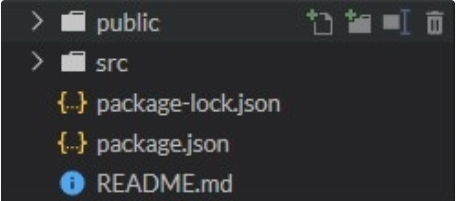

# react_redux

adding React to html in head .

```html
<script src="https://unpkg.com/react@16/umd/react.development.js" crossorigin></script>

 <script src="https://unpkg.com/react-dom@16/umd/react-dom.development.js" crossorigin></script> 
 
 ```
 
 adding JSX
 
 
 ```html
 <script src="https://unpkg.com/babel-standalone@6/babel.min.js"></script>
 ```


For creating react app // React App yaratish uchun - command stroke da mana buni yozing

```
npx create-react-app my-app
cd my-app
npm start
```



Va React ishlashga tayyor.

localhost:3000 bilan brauzerda buni tekshirib ko'rishingiz mumkin.
